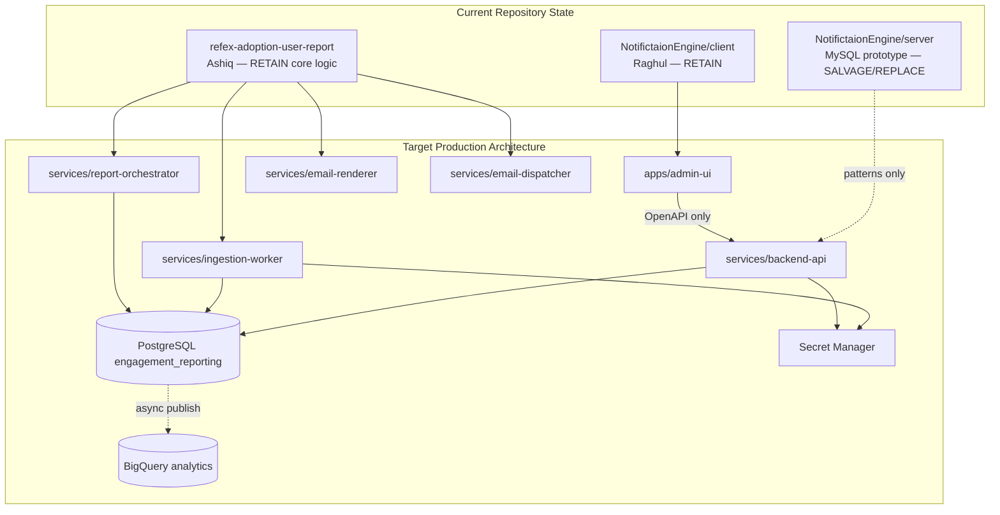

# Component Ownership Map

**Runbook:** `ops/runbooks/01-inspect-repository-convergence-state.sh`  
**Status:** Inspection pass — ownership inferred from code structure and project docs  
**Last updated:** 2026-07-30

---

## Ownership legend

| Status | Meaning |
|--------|---------|
| **RETAIN** | Keep as-is in near term; may move location |
| **SALVAGE** | Extract patterns/data; do not promote implementation |
| **REPLACE** | New implementation required for production |
| **REMOVE** | Delete from repo after convergence |
| **TBD** | Requires human confirmation |

---

## System-level ownership

---

## Component matrix

### Frontend

| Component | Current path | Owner | Status | Target location | Notes |
|-----------|--------------|-------|--------|-----------------|-------|
| Admin UI shell (Layout, Sidebar, Header) | `NotifictaionEngine/client/src/components/feature/` | Raghul | **RETAIN** | `apps/admin-ui/` | Approved UI patterns |
| Application workspace | `client/src/pages/applications/` | Raghul | **RETAIN** | `apps/admin-ui/` | Rebind to backend-api |
| Template builder | `client/src/pages/templates/` | Raghul | **RETAIN** | `apps/admin-ui/` | Map to `report_template` |
| Scheduler UI | `client/src/pages/schedulers/` | Raghul | **RETAIN** | `apps/admin-ui/` | Single schedule model |
| Settings / SMTP UI | `client/src/pages/settings/` | Raghul | **SALVAGE** | `apps/admin-ui/` | Remove SMTP secret fields; Secret Manager refs |
| Login (local password) | `client/src/pages/login/` | Raghul | **REPLACE** | `apps/admin-ui/` | Corporate identity |
| Kissflow direct client | `client/src/services/kissflowClient.ts` | Raghul | **REMOVE** | — | Backend proxy only |
| Dev Kissflow proxy | `client/vite-kissflow-proxy.ts` | Raghul | **REMOVE** | — | Dev-only violation of architecture |
| Mock data | `client/src/mocks/` | Raghul | **REMOVE** | — | After API binding complete |
| API client | `client/src/services/api.ts` | Raghul | **REPLACE** | `packages/api-contracts/` | Generated from OpenAPI |

### Prototype backend (MySQL)

| Component | Current path | Owner | Status | Notes |
|-----------|--------------|-------|--------|-------|
| Express app | `server/app.js` | Raghul/prototype | **REPLACE** | New backend-api service |
| Sequelize models | `server/models/*.js` | Raghul/prototype | **SALVAGE** | Concept mapping only |
| Admin controller | `server/controllers/adminController.js` | Raghul/prototype | **SALVAGE** | API shape hints for OpenAPI |
| Scheduler service | `server/services/schedulerService.js` | Raghul/prototype | **REPLACE** | Cloud Scheduler + orchestrator |
| Email service | `server/services/emailService.js` | Raghul/prototype | **REPLACE** | Outbox + dispatcher |
| Kissflow proxy middleware | `server/middleware/kissflowProxy.js` | Raghul/prototype | **SALVAGE** | Move to backend-api / ingestion-worker |
| DB sync scripts | `server/scripts/sync_db.js` | Raghul/prototype | **REMOVE** | Formal PostgreSQL migrations |
| Orphaned Fastify scaffold | `server/src/index.ts` | — | **REMOVE** | Dead code |

### Engagement pipeline (PostgreSQL)

| Component | Current path | Owner | Status | Target location | Notes |
|-----------|--------------|-------|--------|-----------------|-------|
| Canonical migration | `db/migrations/001-*.sql` | Ashiq | **RETAIN/EXTEND** | `db/migrations/` | Extend for missing domains |
| Load contract | `db/contracts/canonical-load-contract.json` | Ashiq | **RETAIN** | `db/contracts/` | Baseline idempotency policy |
| Ingest runbooks 09/12 | `ops/runbooks/09,12` | Ashiq | **RETAIN** | `services/ingestion-worker/` | Port to typed worker |
| Render runbooks 06/11 | `ops/runbooks/06,11` | Ashiq | **RETAIN** | `services/email-renderer/` | Approved HTML design |
| Send runbook 07 | `ops/runbooks/07` | Ashiq | **RETAIN** | `services/email-dispatcher/` | Add outbox/idempotency |
| Combined pipeline 13 | `ops/runbooks/13` | Ashiq | **SALVAGE** | `services/report-orchestrator/` | Decompose; GCS artifacts |
| HTTP entrypoint | `entrypoint.py` | Ashiq | **REPLACE** | Per-service entrypoints | Cloud Run Job vs Service split |
| Dockerfile | `Dockerfile` | Ashiq | **SALVAGE** | `cloudbuild/` per service | Split images |
| Discovery runbooks 01-04 | `ops/runbooks/01-04` | Ashiq | **RETAIN** | `ops/runbooks/` (legacy prefix) | Dev/discovery only |
| Raw discovery data | `data/discovery/**` | Ashiq | **REMOVE from Git** | Private GCS bucket | PII/customer payloads |
| Generated HTML | `templates/generated/` | Ashiq | **REMOVE from Git** | GCS artifacts | Immutable render output |
| GCP CLI tarball | `google-cloud-cli-darwin-arm.tar.gz` | — | **REMOVE** | — | Not belong in repo |

### Shared / new (not yet present)

| Component | Owner | Status | Target location |
|-----------|-------|--------|-----------------|
| OpenAPI contract | Backend team | **CREATE** | `openapi/backend-api.yaml` |
| API typed client | Frontend + backend | **CREATE** | `packages/api-contracts/` |
| Database models package | Backend | **CREATE** | `packages/database-models/` |
| Kissflow client package | Backend | **CREATE** | `packages/kissflow-client/` |
| Event contracts | Backend | **CREATE** | `packages/event-contracts/` |
| Secrets manifest | Platform | **CREATE** | `config/secrets.manifest.yaml` |
| Cloud Build pipelines | Platform | **CREATE** | `cloudbuild/` |
| Test suites | All | **CREATE** | `tests/` |

---

## API boundary ownership

| Layer | May access | Must NOT access |
|-------|------------|-----------------|
| **Admin UI** | backend-api (OpenAPI) | Cloud SQL, BigQuery, Secret Manager, Kissflow direct, SMTP, Pub/Sub |
| **backend-api** | PostgreSQL, Secret Manager (read), GCS (signed URLs) | Kissflow (delegate to ingestion), SMTP (delegate to dispatcher) |
| **ingestion-worker** | Kissflow API, PostgreSQL, Secret Manager | Frontend, SMTP |
| **report-orchestrator** | PostgreSQL, renderer (private), GCS | Frontend, Kissflow direct |
| **email-renderer** | PostgreSQL (read), GCS (write), template store | SMTP, Frontend |
| **email-dispatcher** | PostgreSQL (outbox), Secret Manager (SMTP), provider API | Frontend, Kissflow |

---

## Schema ownership

| Schema | Authority | Consumer services |
|--------|-----------|-------------------|
| `engagement_reporting` (PostgreSQL) | **Ashiq pipeline + future backend-api** | All backend services |
| `notification_engine` (MySQL) | **Prototype only — not production** | To be decommissioned |
| BigQuery datasets | **Future publication worker** | Analytics, optional report datasets |

---

## Runbook ownership

| Runbook set | Location | Owner | Convergence action |
|-------------|----------|-------|-------------------|
| Legacy 01–13 | `refex-adoption-user-report/ops/runbooks/` | Ashiq | Preserve; renumber or namespace under `ops/runbooks/legacy/` |
| Convergence 01+ | `ops/runbooks/` (repo root) | Platform/convergence | New sequence for repo-wide ops |

---

## Human confirmations required

1. **Raghul** — Confirm `NotifictaionEngine/client` is the complete Admin UI source shared with Ashiq.
2. **Ashiq** — Confirm runbooks 06/07/11 HTML is the approved email design (Srivaths sign-off reference).
3. **Platform** — Confirm IAP/Google identity as auth mechanism before replacing login page.
4. **Security** — Confirm `data/discovery/` removal scope and any Git history rewrite approval.

---

## Next ownership action

Runbook **02-secret-and-sensitive-data-preflight** must complete before any file moves, history rewrites, or backend replacement begin.
